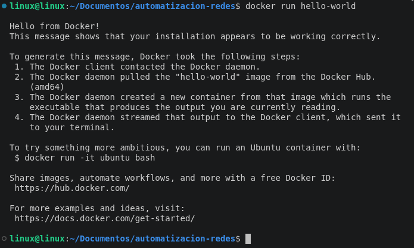
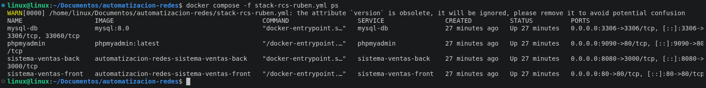

<div align="center">
  
</div>

# ING. EN REDES INTELIGENTES Y CIBERSEGURIDAD

---
## RECUPERACION 1 DE INSTRUMENTO DE EVALUACIÓN 
## Automatización de Infraestructura Digital I
## Unidad I. Entornos de desarrollo en la automatización de redes

**Nombre del Alumno:** RUBEN COLMENERO SANCHEZ

**Grupo:** GIRI6091-E

**Fecha:** 24/06/2026

**Profesor:** Eric Domenzain Morales

---


---

# Índice


   - [Introducción](#introducción)
   - [Desarrollo](#desarrollo)
     - [Descripción de las herramientas utilizadas para automatización](#descripción-de-las-herramientas-utilizadas-para-automatización)
       - [Docker Engine](#docker-engine)
       - [Docker Compose](#docker-compose)
       - [Docker Swagger](#docker-swagger)
     - [Procedimiento de instalación](#procedimiento-de-instalación)
       - [Instalación técnica de herramientas necesarias](#instalación-técnica-de-herramientas-necesarias)
       - [Instalación técnica de docker](#instalación-técnica-de-docker)
       - [Instalación técnica de Git](#instalación-técnica-de-git)
     - [Evidencia de pruebas de verificación de funcionamiento](#evidencia-de-pruebas-de-verificación-de-funcionamiento)
       - [Ejecutar la imagen "hello-world" para verificar el funcionamiento de docker](#ejecutar-la-imagen-hello-world-para-verificar-el-funcionamiento-de-docker)
       - [Ejecutar un archivo ".YML" para verificar el funcionamiento de contenedores](#ejecutar-un-archivo-yml-para-verificar-el-funcionamiento-de-contenedores)
   - [Conclusión](#conclusión)
   - [Bibliografias](#bibliografía)

---
---


# Introducción
El presente reporte documenta el proceso de instalación, configuración y verificación de las principales herramientas utilizadas en el ámbito de la automatización de redes y el despliegue de aplicaciones mediante contenedores. En el contexto actual del desarrollo de software y la administración de infraestructuras, la capacidad de automatizar procesos se ha convertido en una habilidad fundamental para cualquier profesional del área de tecnologías de la información. Durante el desarrollo de esta práctica se trabajó con herramientas ampliamente adoptadas en la industria, entre las que destacan Docker Engine, Docker Compose y Git, las cuales permiten crear entornos de desarrollo reproducibles, portables y fácilmente escalables.

Estas tecnologías forman parte del ecosistema DevOps, un enfoque que busca integrar el desarrollo de software con la operación de sistemas de manera eficiente y continua. El uso de contenedores representa una evolución significativa respecto a las máquinas virtuales tradicionales, ya que permiten empaquetar una aplicación junto con todas sus dependencias en una unidad ligera y autónoma que puede ejecutarse de manera consistente en cualquier entorno, independientemente del sistema operativo subyacente. Esto elimina el clásico problema de "en mi máquina sí funciona", garantizando que el comportamiento de la aplicación sea idéntico en desarrollo, pruebas y producción.

A lo largo de este reporte se describen las herramientas utilizadas, el procedimiento detallado de instalación, las evidenciaredes.

---
---
## Desarrollo

### Descripción de las herramientas utilizadas para automatización:
#### ■ Docker Engine
Docker Engine es el motor principal de la plataforma Docker, responsable de crear, ejecutar y gestionar contenedores. Funciona como un servicio en segundo plano (daemon) que recibe instrucciones a través ds de verificación del funcionamiento del entorno y las conclusiones obtenidas durante el proceso de implementación del entorno de automatización de e una interfaz de línea de comandos (CLI) o una API REST. Docker Engine utiliza características del kernel de Linux como namespaces y cgroups para aislar los procesos dentro de los contenedores, garantizando que cada contenedor tenga su propio sistema de archivos, red y espacio de procesos independiente del sistema anfitrión. A diferencia de las máquinas virtuales, los contenedores no requieren un sistema operativo completo, lo que los hace significativamente más ligeros y rápidos de iniciar. Docker Engine es compatible con sistemas operativos Linux, Windows y macOS, y es la base sobre la cual se construyen todas las demás herramientas del ecosistema Docker.

#### ■ Docker Compose
Docker Compose es una herramienta que permite definir y gestionar aplicaciones multi-contenedor mediante un archivo de configuración en formato YAML (.yml). En lugar de ejecutar cada contenedor de forma individual con comandos largos y complejos, Docker Compose permite describir todos los servicios, redes y volúmenes de una aplicación en un solo archivo y levantarlos con un único comando. Es especialmente útil en entornos de desarrollo donde una aplicación depende de múltiples servicios, como una base de datos, un servidor web y una API backend. Docker Compose gestiona automáticamente las dependencias entre servicios, asegurando que se inicien en el orden correcto.

#### ■ Docker Swagger
Swagger (actualmente conocido como OpenAPI) es una especificación y un conjunto de herramientas para diseñar, construir, documentar y consumir APIs REST. En el contexto de Docker, Swagger puede desplegarse como un contenedor que proporciona una interfaz gráfica interactiva donde los desarrolladores pueden visualizar y probar los endpoints de una API sin necesidad de herramientas externas como Postman. Esto facilita la colaboración entre equipos de desarrollo y permite una documentación siempre actualizada y accesible.

---
## Procedimiento de instalación:
#### ■ Instalación técnica de herramientas necesarias (VSCode, Plugins, etc.)
Visual Studio Code es el editor de código recomendado para el desarrollo con Docker y Node.js. Para instalarlo en Ubuntu:

```shell
sudo apt-get update
sudo apt-get install wget gpg -y
wget -qO- https://packages.microsoft.com/keys/microsoft.asc | gpg --dearmor > packages.microsoft.gpg
sudo install -o root -g root -m 644 packages.microsoft.gpg /etc/apt/trusted.gpg.d/
sudo sh -c 'echo "deb [arch=amd64] https://packages.microsoft.com/repos/vscode stable main" > /etc/apt/sources.list.d/vscode.list'
sudo apt-get update
sudo apt-get install code -y
```

Los plugins recomendados dentro de VSCode son:

- Docker (Microsoft) → gestión de contenedores desde el editor
- Remote - SSH → conexión a servidores remotos
- GitLens → visualización del historial de Git
- YAML → soporte para archivos .yml

#### ■ Instalación técnica de Docker

```shell
sudo apt-get update
sudo apt-get install docker.io -y
sudo apt-get install docker-compose -y
```

Verificar instalación:

```shell
docker --version
docker-compose --version
```

**Resultado:**

```
Docker version 29.6.0, build fb59821
```

Agregar usuario al grupo docker (para no usar sudo):

```shell
sudo usermod -aG docker $USER
newgrp docker
```

#### ■ Instalación técnica de Git

```shell
sudo apt-get update
sudo apt-get install git -y
git --version
```

**Resultado:**

```
git version 2.43.0
```

Configuración inicial:

```shell
git config --global user.email "colmeneroby9@gmail.com"
```

---

### Evidencia de pruebas de verificación de funcionamiento:
#### ■ Ejecutar la imagen "hello-world" para verificar el funcionamiento de docker

Para verificar que Docker Engine está correctamente instalado y funcionando:

```shell
docker run hello-world
```

Salida obtenida:

<div align="center">
  
</div>

#### ■ Ejecutar un archivo ".YML" para verificar el funcionamiento de contenedores

El comando para levantar los 4 servicios fue:

```shell
docker compose -f stack-rcs-ruben.yml up -d
```

EL comando para ver el estado de los contenedores:

```shell
docker compose -f stack-rcs-ruben.yml ps
```

Resultado:

<div align="center">
  
</div>

Se confirma el estado **Up**, 

---

## Conclusión

Durante esta práctica se logró comprender la importancia de utilizar herramientas que facilitan el desarrollo y la administración de aplicaciones modernas. Docker Engine permitió ejecutar los contenedores necesarios para el proyecto, mientras que Docker Compose simplificó la puesta en marcha de todos los servicios mediante una sola configuración, haciendo el proceso más ordenado y eficiente.

Además, el uso de Git complementó el trabajo realizado al permitir un mejor control de los cambios y versiones del proyecto, algo fundamental cuando se trabaja de manera profesional o colaborativa. La combinación de estas herramientas demuestra cómo una correcta organización del entorno de trabajo puede reducir tiempos de configuración, minimizar errores y agilizar el desarrollo de aplicaciones.

En general, esta actividad permitió conocer tecnologías ampliamente utilizadas en la industria y entender cómo el uso de contenedores ayuda a crear entornos más rápidos, consistentes y fáciles de implementar, aportando beneficios importantes tanto en proyectos pequeños como en soluciones de mayor escala.

---

## Bibliografía

Docker, Inc. (2026). Docker Documentation.
https://docs.docker.com/

Docker, Inc. (2026). Docker Compose Documentation.
https://docs.docker.com/compose/

Docker Inc. (2024). *Docker Hub*.
  https://hub.docker.com/

Linux Foundation. (2024). *Git reference manual*.
  https://git-scm.com/docs

Microsoft. (2024). *Visual Studio Code documentation*.
  https://code.visualstudio.com/docs

mazon Web Services. (2026). *What is DevOps?*
https://aws.amazon.com/devops/what-is-devops/